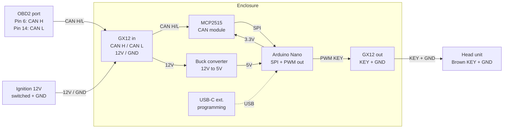

# Subaru SWC CAN Interface


This project provides Arduino Nano firmware to interface between a 2013 Subaru Impreza (GJ/GP) CAN bus and an aftermarket head unit's resistive Steering Wheel Control (SWC) input. It serves as an open-source / DIY alternative to commercial interfaces like the **Aerpro CHSU14C** or **iDatalink Maestro SWC**.

## Goal

The objective is to read steering wheel button presses from the car's CAN bus (via the OBD2 port) and translate them into specific analog voltage levels. These levels are generated using PWM on the Arduino and are designed to be read by the head unit's SWC "KEY" wire, which typically uses a resistor-ladder protocol.

### Supported Functions
- Volume Up / Down
- Next / Previous Track
- Mode
- Mute
- Call Answer / Reject
- Voice Activation

## Hardware Requirements

- **Microcontroller**: Arduino Nano (USB-C version recommended)
- **CAN Interface**: MCP2515 CAN Bus Module
- **Connection**: OBD2 Port (CAN High: Pin 6, CAN Low: Pin 14)
- **Interrupt Handling**: Uses hardware interrupt on pin D2 for reliable message reception.
- **Output**: PWM Pin (D9) connected to the head unit's SWC wire.

## Software Setup

This project uses `arduino-cli` for compilation and deployment. A `Makefile` is provided to simplify common tasks.

### 1. Install Dependencies
Ensure you have `arduino-cli` installed on your system. Then, run the following command to install the required AVR core and the MCP2515 library:

```bash
make install-deps
```

### 2. Compile
To compile the firmware locally:

```bash
make
```

### 3. Pre-compiled Binaries
If you don't want to compile the code yourself, you can download the latest pre-compiled `.hex` files from the [Releases](https://github.com/nicksantamaria/arduino-subaru-impreza-swc/releases) page. These can be uploaded to your Arduino Nano using tools like `avrdude` or specialized hex uploaders.

### 4. Upload
Connect your Arduino Nano and run (adjust the `PORT` in the `Makefile` if necessary):

```bash
make upload
```

### 5. Monitor
To view serial debug output (raw CAN IDs and button detection):

```bash
make monitor
```

## Configuration

You can tune the following constants at the top of `arduino-subaru-impreza-swc.ino`:
- `CAN_FREQ`: Set to `MCP_8MHZ` or `MCP_16MHZ` depending on your module's crystal.
- `SWC_CAN_ID`: The CAN ID for steering wheel messages (defaulted to `0x242`).
- `PWM_OUT_PIN`: The Arduino pin used for PWM output (defaulted to `D9`).
- `VOL_UP_PWM`, etc.: The duty cycle values (0-255). These are pre-configured to match the **Sony resistive ladder standard** (similar to RM-X4S), making it compatible with most aftermarket head units that support Sony remotes or have a learning mode.

## Physical build specs

### Parts list

| Component | Detail | Source |
|---|---|---|
| Arduino Nano (USB-C) | ATmega328P, USB-C variant | AliExpress |
| MCP2515 CAN bus module | SPI interface, 8MHz crystal | AliExpress |
| 12V–5V buck converter | Solder-point terminals | AliExpress |
| GX12 4-pin connectors | x5 (input, output, spare) | AliExpress |
| Project enclosure | Min. 100×60×25mm | AliExpress |
| Female-to-female DuPont jumpers | 10cm, for Nano↔MCP2515 | AliExpress |
| Stripboard / perfboard | For permanent internal joints | AliExpress |
| M3 standoffs + screws | Self-tapping into enclosure floor | AliExpress |
| Heat shrink tubing | Assorted sizes | AliExpress |
| OBD2 breakout cable | Bare wire ends, min. 500mm | AliExpress |
| USB-C extension cable | 500–1000mm, for programming access | AliExpress |
| Scotch lock / splice connectors | For KEY wire tap (no permanent cut) | Local auto parts |

### Wiring



**CAN bus source**: OBD2 port pin 6 (CAN High) and pin 14 (CAN Low). No wires need to be tapped behind the dash.

**Power**: Ignition-switched 12V and GND feed the buck converter. The buck converter outputs 5V to the Arduino Nano's 5V pin. Do not power the Nano from USB during normal operation.

**KEY output**: A PWM pin on the Nano outputs a voltage level corresponding to each button press. This connects via GX12 connector to the head unit's brown KEY wire. GND is shared.

**Programming access**: The USB-C extension cable routes from the Nano to an accessible point under the steering column. The car does not need to be disassembled to deploy firmware updates.

### Enclosure layout

Mount the Nano and MCP2515 on M3 standoffs screwed into the enclosure floor. Connect them with 10cm female-to-female DuPont jumpers (SPI: MOSI, MISO, SCK, CS, INT, 5V, GND). The buck converter is wired with short soldered leads terminated at the GX12 input connector pins. Both GX12 connectors panel-mount in the enclosure walls.

- [ ] **Wiring Diagram**: Create a schematic showing connections between Nano, MCP2515, and OBD2 port.
- [ ] **RC Filter**: Design and document a simple RC low-pass filter (e.g., 10kΩ resistor + 10µF capacitor) to smooth the PWM signal into a steady DC voltage for the head unit.
- [ ] **Enclosure**: Design or select a suitable 3D-printable case for the electronics.
- [ ] **Vehicle Verification**: Confirm exact CAN IDs and data bytes for the 2013 Subaru Impreza via the Serial Monitor during bench testing.
